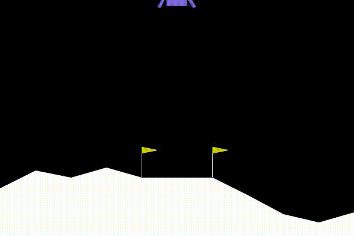
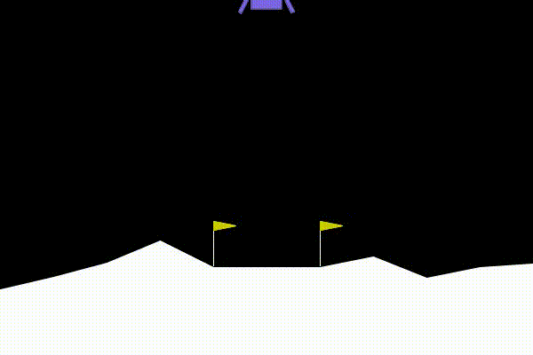

# Lunar-Lander-RL
This is an exercise using Actor-Critic and Deep Q Networks for OpenAI's gym environment, specifically the continuous and discrete versions of `LunarLander-v2`. The models for discrete action spaces are designed with straightforward `nn.Linear` layers and `ReLU` activation functions, culminating in 18,180 parameters and 279 kilobytes for weight storage.

For continuous RL models (Actor/Critic), the Actor model outputs a Gaussian Normal Distribution of the action space based on the given state. The Critic model is defined as a Q-Value function that outputs a scalar score based on the given state and action pair. Noise injection is added to the action outputs to enable additional exploration capabilities. Using Actor/Critic, with proper hyperparameters, convergences was accomplished in 1/4 the episodes for discrete Q-Networks in discrete action space.

## Results
Continuous Action space (left) and Discrete Action space (Right) results from testing. I'm not sure if there was training errors for discrete but continuous clearly lands smoother on terrain despite less episodes for training.
<div style="display: flex; justify-content: center; flex-wrap: wrap; gap: 20px; max-width: 90%; margin: 0 auto;">
    
    
</div>


## Installation
1. Git clone the repository 
```bash
git clone https://github.com/CodeKnight314/Lunar-Lander-RL.git 
cd Lunar-Lander-RL
```
2. Create and activate a virtual environment (optional but recommended)
```bash
python -m venv lunar-env
source lunar-env/bin/activate
```
3. Install necessary pacakages 
```bash
pip install -r src/requirements.txt
```
## Training
You can start the training process via `main.py`: 
```bash
python src/main.py --c path/to/config --o path/to/output --train --env [discrete/continuous]
```
This will start the training process based on the given configs then record the model in simulation before saving to specified directory. You can specify discrete or continuous action space via `--env` flag. 

## Testing
You can start and save evaluation results via `main.py`:
```bash
python src/main.py --c path/to/config \
                    --o path/to/output \
                    --w path/to/weights \
                    --test \
                    --env [discrete/continuous]
```
